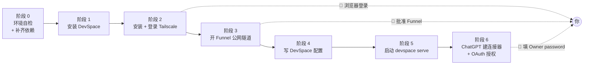

# chatgpt-mcp-connector

**一个把本地自托管 MCP 服务器接入 ChatGPT 网页版的 Agent Skill。**
从环境自检开始，一路走到「在 ChatGPT 对话里真的调用到本地工具」为止，中途不需要你去翻文档。

> 实测环境：Windows 11 + Git Bash · DevSpace `1.0.8` · Tailscale `1.102.4` · Node `24.15.0` ·
> ChatGPT 新版中文 UI + Plus 账号。
> 版本差异会影响命令语法（尤其 Tailscale），照做前先跑一遍 `--version`。

---

## 它解决什么问题

「让 ChatGPT 网页版读我本地代码」这件事，网上教程很多，但真正卡人的从来不是原理，而是这些：

- 依赖**差一个就整条流程跑不通**，而且往往在最后一步才报错，前功尽弃；
- Tailscale 的登录、MagicDNS、Funnel 首次批准**分散在浏览器和后台**，脚本替不了，但没人告诉你该停在哪；
- DevSpace 配置写错一个键，**服务能起来但 ChatGPT 连不上**，日志里只有一句含糊的 404；
- 官方教程里 `devspace init` 是交互式的，**没法在自动化流程里跑**，于是只能手敲配置，很容易踩坑；
- 最要命的一条：配置文件被写坏了，工具顺手「帮你重置」——**Owner password 直接换掉，之前建的连接器全废**。

这个 Skill 把这些坑全部前置处理掉了。

---

## 特性

| 能力 | 说明 |
| --- | --- |
| **环境自检 + 自动补齐** | 7 项依赖（Node / npm / Git / Bash / Tailscale / DevSpace / better-sqlite3）+ 包管理器探测；`--install` 可自动安装缺失项 |
| **配置全自动写入** | 不依赖交互式 `devspace init`，直接按参数写 `config.json`，只改显式传入的键 |
| **容错与回滚** | 配置损坏**拒绝写盘**并另存 `.corrupt-*`、写前自动 `.bak` 备份、原子替换、超时重试、`rollback` 一键恢复 |
| **🙋 人工介入点提醒** | 明确标出必须由用户亲自完成的 8 个步骤（浏览器登录、Funnel 批准、填 Owner password 等），检测到未登录/未启用会主动打提醒 |
| **故障速查** | 约 20 条常见报错的排查表，含「已证伪的伪根因」，避免在错误方向上浪费时间 |
| **安全边界说明** | 讲清 `allowedRoots` 不是沙箱、symlink 绕过、`DEVSPACE_ALLOWED_HOSTS=*` 的风险 |

---

## 前置条件

| 项 | 要求 | 备注 |
| --- | --- | --- |
| 操作系统 | Windows / macOS / Linux | 实测在 Windows 11 + Git Bash |
| Node.js | `>=20.12 <27` | README 官方口径 `>=22.19 <27`，CLI 内部更宽 |
| Bash | Git Bash ★ / MSYS2 / Cygwin / WSL / PortableGit | Windows 上常并存多个，选错会导致 DevSpace 行为异常 |
| Git | 任意近期版本 | — |
| Tailscale | `1.102.4` 实测可用 | 需登录且开启 MagicDNS |
| ChatGPT | 网页版 + 付费账号，需开启**开发者模式** | 连接器功能需要 |

以上全部可以由 `env-check.mjs --install` 自动检查并补齐（安装时可能弹 UAC 提权）。

---

## 安装这个 Skill

把下面这段话**整段复制给 WorkBuddy / 你的 Agent**，它会自己完成安装和校验：

```text
请帮我把 chatgpt-mcp-connector 这个 Skill 安装到本地：

从 GitHub 克隆 hawklithm/chatgpt-mcp-connector 到 ~/.workbuddy/skills/chatgpt-mcp-connector，
装好后用 skill-creator 的 quick_validate.py 校验一次，确认返回 "Skill is valid!"，
最后把 SKILL.md 里的 description 念给我看一下，确认它已经能被正确识别。
```

如果你想自己动手，命令行是两条：

```bash
# 1. 克隆到用户级 skill 目录（跨项目可用）
git clone git@github.com:hawklithm/chatgpt-mcp-connector.git ~/.workbuddy/skills/chatgpt-mcp-connector

# 2. 校验
python <skill-creator>/scripts/quick_validate.py ~/.workbuddy/skills/chatgpt-mcp-connector
```

**放在哪里？**

| 位置 | 作用范围 | 适用场景 |
| --- | --- | --- |
| `~/.workbuddy/skills/` | 用户级，**所有项目**可用 | 推荐，一次装好到处能用 |
| `<项目>/.workbuddy/skills/` | 项目级，随仓库共享 | 团队协作、想让同事克隆项目就有 |

装好后无需重启，下一次对话里提到「把本地 MCP 接入 ChatGPT」它就会被触发。

---

## 快速开始

装好之后，直接对 Agent 说一句就行：

```text
帮我把本地 MCP 接入 ChatGPT，可访问目录用 D:\projects\my-app
```

它会按下面的流程走，并在需要你亲自操作的地方停下来提醒你：



### 各阶段验收信号

| 阶段 | 关键命令 | 验收信号 |
| --- | --- | --- |
| 0 环境 | `node scripts/env-check.mjs` | 输出「✅ 全部就绪」 |
| 1 DevSpace | `npm i -g @waishnav/devspace` | `devspace -v` → `1.0.8` |
| 2 Tailscale | `tailscale up` → `tailscale status` | 有 `Self`，IP 为 `100.x` |
| 3 隧道 | `tailscale funnel --bg 7676` | `funnel status` 出现 `(Funnel on)` |
| 4 配置 | `devspace-bootstrap.mjs apply --roots ...` | 启动日志 `allowed roots:` 符合预期 |
| 5 启动 | `devspace serve` | `/healthz` 本地与公网均 200 |
| 6 连接器 | `chatgpt.com/plugins` → 创建应用 | 日志出现 `openai-mcp/1.0.0` + `200` |

> 阶段 5 有个容易误判的点：公网 `/mcp` 返回 **401 是正确的**，那是 OAuth 的触发点，不是故障。

---

## 仓库结构

```
chatgpt-mcp-connector/
├── SKILL.md                        # 主文件：触发条件、0→1 流程、铁律、参考导航
├── references/                     # 分阶段详细文档（按需加载，不占主上下文）
│   ├── env-setup.md                # 阶段 0–1：依赖清单、各平台安装、装后两个坑
│   ├── tailscale-funnel.md         # 阶段 2–3：登录、Funnel 前置条件与语法、域名推导
│   ├── devspace-config.md          # 阶段 4–5：两个配置文件、环境变量总表、OAuth 持久化
│   ├── chatgpt-connector.md        # 阶段 6：建连接器步骤、浏览器自动化要点
│   └── troubleshooting.md          # 容错设计、故障速查表、已证伪的伪根因
├── scripts/
│   ├── env-check.mjs               # 环境自检 + 缺失自动补齐
│   └── devspace-bootstrap.mjs      # 配置写入 / 体检 / 回滚
├── README.md
├── LICENSE
└── .gitignore
```

---

## 自带脚本

```bash
SK=~/.workbuddy/skills/chatgpt-mcp-connector/scripts
```

### `env-check.mjs` —— 环境自检 + 缺失自动补齐

```bash
node $SK/env-check.mjs                             # 只读自检：打印结果 + 缺失项的安装命令
node $SK/env-check.mjs --json                      # 机器可读（供 Agent 解析）
node $SK/env-check.mjs --install                   # 真的执行安装
node $SK/env-check.mjs --install --only node,git   # 只装指定项
```

退出码：`0` 全就绪 / `1` 有缺失 / `2` 脚本自身出错。

- Node 按 `>=20.12 <27` 校验；
- Bash 会**列出所有候选并标推荐项**（★ Git Bash > MSYS2 > Cygwin > WSL > PortableGit）；
- Tailscale 读 `status --json` 的 `BackendState` 判断登录态，未登录时提醒用户；
- 每项独立 try/catch，外部命令带超时（探测 15s / 安装 10min）；
- `--install` 单项失败**不中断整轮**，末尾汇总「自动成功 / 自动失败 / 需手动 / 已跳过」；
- 退出码反映**自检当时**的状态——刚装完但 PATH 未刷新仍返回 `1`，不报假绿。

> **⚠️ 安装前必须先征得同意。** 默认不安装任何东西，只有显式 `--install` 才会执行命令。

### `devspace-bootstrap.mjs` —— 写 DevSpace 配置

```bash
node $SK/devspace-bootstrap.mjs check        # 只读体检：Node / tailscale / 隧道 / 域名推导 / 现有配置
node $SK/devspace-bootstrap.mjs apply \
     --roots "D:\projects\my-app" [--port 7676] [--host 127.0.0.1] \
     [--public-base-url https://x.ts.net] [--subagents codex,claude] \
     [--dry-run] [--force]
node $SK/devspace-bootstrap.mjs rollback [--config|--auth]   # 从 .bak 恢复
```

**行为保证**

- `check` 绝不写盘；
- `apply` 只改**显式传入**的键，**绝不覆盖已有 `ownerToken`**，内容无变化时不动文件（幂等）；
- 自动从 Tailscale 推导 `publicBaseUrl`，无需手填；
- **不调用** `devspace init`（那是交互式的，会重问所有问题）。

**容错保证**

- 配置损坏时**拒绝写盘**并另存 `.corrupt-<时间戳>`，而不是静默清空；
- 写入前自动备份 `.bak`，采用**原子替换**（临时文件 + rename）；
- 所有校验在写盘前完成，失败即退出，**不留半成品**。

---

## 三条不可违背的铁律

1. **绝不 `tailscale funnel --set-path=/mcp`**
   挂载路径会被剥掉，公网 `/mcp` 变成 `/` → 404；而且 DevSpace 的 OAuth 路由在 `/mcp` 之外。
   必须代理整个 origin。

2. **连接器必须在 `chatgpt.com/plugins` 页创建**
   「设置」里只用来开开发者模式。两处表单字段一模一样，走错必报 `Something went wrong`。

3. **Owner password 只在浏览器授权页填写**
   永远不要让用户把它贴进聊天或日志。

---

## 安全边界（请务必读）

- `allowedRoots` **不是操作系统沙箱**——shell 命令以**本机用户权限**运行。
- 别把含密钥、客户数据、生产配置的仓库放进去；**先用只读 prompt 验证边界**。
- 白名单限制到当前真正需要的项目，别图省事填整个磁盘（脚本会对盘符级白名单告警）。
- 注意白名单内的 softlink：已知 issue #45，路径比较是字符串级、不解析 symlink 目标。
- `DEVSPACE_ALLOWED_HOSTS=*` 会关闭 Host 校验，**仅本地调试用**。
- 用完记得关公网入口：`tailscale funnel reset`。
- `ownerToken` 是 43 字符**明文**存在 `~/.devspace/auth.json`，等同于账号密码，注意文件权限。

---

## 常见问题

| 现象 | 去哪看 |
| --- | --- |
| `MCP server ... does not implement OAuth` | `references/troubleshooting.md` |
| ChatGPT 报 `Something went wrong` | 先检查是不是在 `plugins` 页建的连接器（铁律 2） |
| `path is outside allowed roots` | `references/devspace-config.md` |
| 隧道域名变了、连接器连不上 | `references/tailscale-funnel.md`，重建或 Refresh 连接器 |
| 配置文件损坏 / 想回退改动 | `references/troubleshooting.md`，用 `rollback` |
| Funnel 用不了 | `references/troubleshooting.md` 的降级路径（cloudflared） |

---

## 外部参考

- DevSpace 官方文档：仓库 `Waishnav/devspace` 下的 `docs/`
- OpenAI 连接器文档：`developers.openai.com/plugins/deploy/connect-chatgpt`
- Tailscale Funnel：`tailscale.com/kb/1247/funnel-serve-use-cases`

---

## 许可证

[MIT](LICENSE) © 2026 hawklithm
