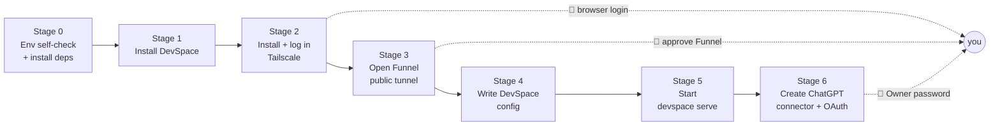

# chatgpt-mcp-connector

**English** · [简体中文](README.zh-CN.md)

**An Agent Skill that connects a self-hosted local MCP server to the ChatGPT web UI.**
It starts with an environment self-check and carries you all the way to "ChatGPT is actually calling
tools on my machine" — no doc-diving required along the way.

> Tested on Windows 11 + Git Bash · DevSpace `1.0.8` · Tailscale `1.102.4` · Node `24.15.0` ·
> the new ChatGPT UI on a Plus account.
> Version differences affect command syntax (Tailscale especially) — run `--version` before following along.
>
> **Platform support**: Windows, macOS and Linux are all supported, with no code changes to the scripts.
> Only **Windows has been verified on real hardware** — the macOS / Linux conclusions come from reading
> the DevSpace source, not from an actual run.
> Differences cluster in four places: how dependencies are installed, how the shell is resolved,
> the Tailscale service model, and path syntax.
> See [`references/cross-platform.md`](references/cross-platform.md).

---

## What it solves

There is no shortage of tutorials on "let ChatGPT read my local code". What actually blocks people is
never the theory — it is these:

- **One missing dependency breaks the whole pipeline**, and it usually fails at the very last step,
  after you have already invested everything;
- Tailscale login, MagicDNS and the first-time Funnel approval are **scattered across browser and admin
  console**; no script can do them, and nobody tells you where to stop;
- Get one key wrong in the DevSpace config and **the server starts but ChatGPT cannot connect** — all you
  get in the log is a vague 404;
- The official flow's `devspace init` is interactive, so it **cannot run inside automation** — you end up
  hand-editing config and stepping on landmines;
- The worst one: if the config file gets corrupted, the tooling helpfully "resets" it — the **Owner
  password is silently replaced and every connector you built is dead**.

This skill front-loads all of those traps.

---

## Features

| Capability | Detail |
| --- | --- |
| **Environment self-check + auto-fix** | 7 dependencies (Node / npm / Git / Bash / Tailscale / DevSpace / better-sqlite3) plus package-manager detection; `--install` installs what is missing |
| **Cross-platform** | Install commands, CLI locations, path syntax, shell resolution and the Tailscale service model are all handled for Windows / macOS / Linux; the scripts branch by platform, **no code changes needed** |
| **Fully automatic config writing** | Does not rely on the interactive `devspace init`; writes `config.json` from arguments and only touches keys you explicitly pass |
| **Fault tolerance & rollback** | Refuses to write when the config is corrupt and quarantines it as `.corrupt-*`, auto-backs up to `.bak`, atomic replace, timeouts, one-command `rollback` |
| **🙋 Human-in-the-loop reminders** | Explicitly marks the 8 steps only a human can do (browser login, Funnel approval, entering the Owner password, …) and flags them proactively when it detects an unlogged or unconfigured state |
| **Troubleshooting** | ~20 rows of common errors, including a "debunked false root cause" section so you do not waste time down the wrong path |
| **Security boundaries** | Explains that `allowedRoots` is *not* a sandbox, plus the symlink bypass and the `DEVSPACE_ALLOWED_HOSTS=*` risk |

---

## Prerequisites

| Item | Requirement | Notes |
| --- | --- | --- |
| OS | Windows / macOS / Linux | All three work; **verified on Windows 11 + Git Bash** |
| Node.js | `>=20.12 <27` | The package README says `>=22.19 <27`; the CLI itself is more permissive |
| Bash | Windows: **mandatory** — Git Bash ★ / MSYS2 / Cygwin / WSL / PortableGit<br>macOS / Linux: `/bin/bash` (ships by default) | Windows often has several; picking the wrong one makes DevSpace behave oddly. **On Windows a missing bash is fatal** (no fallback); macOS/Linux degrade to `/bin/sh` |
| Git | Any recent version | — |
| Tailscale | `1.102.4` verified | Must be logged in with MagicDNS enabled; on Linux the CLI needs root by default — use `--operator` |
| ChatGPT | Web UI + paid account with **developer mode** enabled | Required for connectors |

> Platform quick reference (install commands / CLI locations / path syntax / common traps):
> [`references/cross-platform.md`](references/cross-platform.md).

All of the above can be checked and filled in by `env-check.mjs --install` (installs may raise a UAC prompt).

---

## Install the skill

Copy the block below **verbatim to WorkBuddy / your agent** and it will install and validate itself:

```text
Please install the chatgpt-mcp-connector skill locally for me:

Clone the GitHub repository hawklithm/chatgpt-mcp-connector into
~/.workbuddy/skills/chatgpt-mcp-connector, then validate it with skill-creator's
quick_validate.py and confirm it prints "Skill is valid!". Finally read me the description
from SKILL.md so I can confirm it will be recognized.
```

Or do it yourself — two commands:

```bash
# 1. Clone into the user-level skill directory (available across all projects)
git clone https://github.com/hawklithm/chatgpt-mcp-connector.git ~/.workbuddy/skills/chatgpt-mcp-connector

# 2. Validate
python <skill-creator>/scripts/quick_validate.py ~/.workbuddy/skills/chatgpt-mcp-connector
```

**Where should it live?**

| Location | Scope | When to use |
| --- | --- | --- |
| `~/.workbuddy/skills/` | User-level, **all projects** | Recommended — install once, works everywhere |
| `<project>/.workbuddy/skills/` | Project-level, shared with the repo | Team work — anyone who clones the project gets it |

> If your harness uses a different skill-directory convention, installing there works too — just swap the
> paths in the prompt below to match.

No restart needed. The next time you mention "connect my local MCP to ChatGPT", it triggers.

---

## One-shot prompt: let an agent install **and** configure everything

The block above only *installs*. The one below **installs and then runs the whole pipeline**: paste it
into any harness (WorkBuddy / Claude Code / Codex / Cursor / …) and it will work through the SKILL.md
procedure, pausing at every step that requires a human.

It can drive an arbitrary harness because the procedure lives in **files** (`SKILL.md` + `references/`).
The prompt only routes the harness there and gives it a pass criterion and a pause point per stage — it
depends on no harness-specific capability.

```text
Install and run the chatgpt-mcp-connector skill, end to end.

Goal: get a local MCP server (DevSpace) running on this machine so the ChatGPT web UI can reach it
      over public HTTPS, and can read and write files under a directory I choose.

== Setup ==

1) Install the skill (idempotent — skip if already present):
   Clone the GitHub repository hawklithm/chatgpt-mcp-connector into
   ~/.workbuddy/skills/chatgpt-mcp-connector
   (if your harness uses a different skill-directory convention, install there instead and
    substitute that path everywhere below)

2) Read ~/.workbuddy/skills/chatgpt-mcp-connector/SKILL.md in full.
   It is the authoritative procedure — follow it, not your own assumptions.
   Then read references/cross-platform.md and apply the section for this OS.

3) Ask me which directory ChatGPT may access; call it PROJECT_DIR.

== Execution ==

Work through the stages in order. After each stage, report what you ran, the evidence, and what comes
next — then continue. Whenever a step is marked 🙋 in SKILL.md, STOP AND ASK ME: those can only be done
by a human in a browser, and you cannot substitute for that.

Stage 0  Environment self-check (read-only first)
    node ~/.workbuddy/skills/chatgpt-mcp-connector/scripts/env-check.mjs
    Show me the missing items and the exact install commands you intend to run.
    WAIT for me to approve, then re-run with --install.
    Pass: output ends with "✅ 全部就绪" and exit code 0.
    Note: right after installing, PATH is not refreshed, so it can still exit 1 — open a new terminal
    and re-run rather than reporting a false green.

Stage 1  Install DevSpace
    npm install -g @waishnav/devspace
    Pass: devspace -v prints a version.

Stage 2  Install and log in to Tailscale
    Install it if missing (use the command for this OS from references/cross-platform.md), then run
    tailscale up.
    🙋 PAUSE: it prints a login link; I must open it in a browser and approve the device joining my
    tailnet.
    Pass: tailscale status shows Self with an address starting 100.

Stage 3  Open the public tunnel
    tailscale funnel --bg 7676
    NEVER add --set-path=/mcp — it strips the mount path, turning public /mcp into / and returning 404,
    and the OAuth discovery routes live outside /mcp anyway. Proxy the whole port.
    🙋 If this is the first time Funnel is enabled, Tailscale prints an approval link — I have to click
    it in a browser.
    Pass: tailscale funnel status shows "(Funnel on)" plus a line reading
          "proxy http://127.0.0.1:7676".

Stage 4  Write the DevSpace config
    Show me what would change first:
      node ~/.workbuddy/skills/chatgpt-mcp-connector/scripts/devspace-bootstrap.mjs \
           apply --roots "PROJECT_DIR" --dry-run
    Once I confirm, re-run without --dry-run to actually write it.
    Pass: the serve log's "allowed roots:" line matches what I asked for.

Stage 5  Start the server
    cd PROJECT_DIR && devspace serve        # must stay running; if it stops, ChatGPT disconnects
    Pass: http://127.0.0.1:7676/healthz returns 200, and https://<funnel-domain>/healthz returns 200.
    Note: https://<funnel-domain>/mcp returning 401 is CORRECT — that is the OAuth entry point, not a
    failure.
    🙋 Keep it running in the background and tell me how to stop it.

Stage 6  Create the ChatGPT connector and authorize
    Prepare and state plainly the values I need to enter:
      Server URL : https://<funnel-domain>/mcp
      Auth       : OAUTH
    🙋 PAUSE: I create the connector myself at https://chatgpt.com/plugins
       It MUST be created on that page — the form under Settings has identical fields but always fails
       with "Something went wrong. If this issue persists please contact us through our help center."
    🙋 PAUSE: after it redirects to /authorize, I enter the Owner password myself in the browser.
       Just tell me to look up the ownerToken field in the auth.json inside the DevSpace config
       directory.
    Pass: the DevSpace server log shows userAgent: openai-mcp/1.0.0 with a 200 response, plus an
          mcp_session_created line.
    Finally, open a new conversation and attach DevSpace from the tools menu — that is the real proof
    it works.

== Rules ==

- Do not run any installer without my explicit approval for that specific command.
- Never print, echo, or ask me to paste the Owner password into the chat. Only tell me where it lives.
- Never use tailscale funnel --set-path; always proxy the whole port.
- If any step fails, read references/troubleshooting.md before improvising.
- If your environment contradicts an assumption in the docs (version, path, shell), say so instead of
  guessing.

Start with Stage 0 now.
```

**What that prompt guarantees** — i.e. the mistakes it blocks for you:

| Stage | The easy mistake when nobody is watching | Constraint in the prompt |
| --- | --- | --- |
| 0 | Running `--install` without asking, or reading "PATH not refreshed yet" as an install failure | Read-only first → list commands → wait for approval; exit-code semantics spelled out |
| 2 | Re-running `tailscale up` in a loop while it is actually waiting on your browser | Explicitly designated a 🙋 pause point |
| 3 | Reflexively adding `--set-path=/mcp` → public `/mcp` 404s | Hard prohibition, with the reason |
| 4 | Writing straight to disk, or invoking the interactive `devspace init` and hanging | `--dry-run` diff is mandatory first |
| 5 | Misreading the public `/mcp` 401 as a failure and "fixing" the server | States plainly that 401 is correct |
| 6 | Creating the connector under Settings → `Something went wrong` | Points at the `plugins` page |
| 6 | Getting the user to paste the Owner password into the chat | Forbidden; the agent tells you the file location instead |

---

## Quick start (driving it manually)

Once installed, a single sentence to your agent is enough:

```text
Connect my local MCP to ChatGPT, using D:\projects\my-app as the accessible directory.
```

It then walks the flow below, stopping to remind you wherever your own action is required:



### Pass criteria per stage

| Stage | Key command | Pass criterion |
| --- | --- | --- |
| 0 Env | `node scripts/env-check.mjs` | Prints "✅ 全部就绪" |
| 1 DevSpace | `npm i -g @waishnav/devspace` | `devspace -v` → `1.0.8` |
| 2 Tailscale | `tailscale up` → `tailscale status` | `Self` present, address starts with `100.` |
| 3 Tunnel | `tailscale funnel --bg 7676` | `funnel status` shows `(Funnel on)` |
| 4 Config | `devspace-bootstrap.mjs apply --roots ...` | Serve log's `allowed roots:` is as expected |
| 5 Serve | `devspace serve` | `/healthz` returns 200 locally **and** publicly |
| 6 Connector | `chatgpt.com/plugins` → create app | Log shows `openai-mcp/1.0.0` + `200` |

> One easy misread at stage 5: a public `/mcp` returning **401 is correct** — that is the OAuth entry
> point, not a fault.

---

## Repository layout

```
chatgpt-mcp-connector/
├── SKILL.md                        # Main file: triggers, 0→1 flow, iron rules, reference index
├── references/                     # Per-stage detail (loaded on demand, kept out of the main context)
│   ├── cross-platform.md           # Win/mac/Linux: install commands, paths, shell, Tailscale, per-OS traps
│   ├── env-setup.md                # Stages 0–1: dependency list, per-OS install, env pitfalls
│   ├── tailscale-funnel.md         # Stages 2–3: login, Funnel prerequisites & syntax, domain derivation
│   ├── devspace-config.md          # Stages 4–5: config files, env var table, OAuth persistence
│   ├── chatgpt-connector.md        # Stage 6: connector steps, browser automation notes
│   └── troubleshooting.md          # Fault-tolerance design, error lookup, debunked root causes
├── scripts/
│   ├── env-check.mjs               # Environment self-check + auto-install of what is missing
│   └── devspace-bootstrap.mjs      # Config write / doctor / rollback
├── README.md                       # English (this file)
├── README.zh-CN.md                 # 简体中文
├── LICENSE
└── .gitignore
```

---

## Bundled scripts

```bash
SK=~/.workbuddy/skills/chatgpt-mcp-connector/scripts
```

### `env-check.mjs` — environment self-check + auto-install

```bash
node $SK/env-check.mjs                             # read-only: results + install commands for gaps
node $SK/env-check.mjs --json                      # machine-readable (for agents)
node $SK/env-check.mjs --install                   # actually run the installs
node $SK/env-check.mjs --install --only node,git   # install only the named items
```

Exit codes: `0` all ready / `1` something missing / `2` the script itself failed.

- Node is validated against `>=20.12 <27`.
- Whether a dependency is installed is decided by **running commands** (`where` / `which` / `--version`),
  never by guessing install directories. Bash candidates come from `where bash.exe` plus a derivation
  from `where git`, so Git on any drive is found — and the scripts contain no hard-coded drive letters.
- Bash: **all candidates are listed with a recommended one** (★ Git Bash > MSYS2 > Cygwin > WSL > PortableGit).
- Tailscale login state is read from `BackendState` in `status --json`, with per-OS guidance when unlogged.
- Every check is independently wrapped; external commands run with timeouts (15s probe / 10min install).
- With `--install`, a single failure **does not abort the batch**; a summary reports
  auto-succeeded / auto-failed / needs-manual / skipped.
- If the package manager is not present, it **skips with an explanation** rather than throwing ENOENT.
- Exit codes reflect the state **at check time** — right after installing, an unrefreshed PATH still
  returns `1` rather than a false green.

> **⚠️ Consent first.** Nothing is installed by default; only an explicit `--install` executes commands.

### `devspace-bootstrap.mjs` — write the DevSpace config

```bash
node $SK/devspace-bootstrap.mjs check        # read-only: Node / tailscale / tunnel / domain / current config
node $SK/devspace-bootstrap.mjs apply \
     --roots "D:\projects\my-app" [--port 7676] [--host 127.0.0.1] \
     [--public-base-url https://x.ts.net] [--subagents codex,claude] \
     [--dry-run] [--force]
node $SK/devspace-bootstrap.mjs rollback [--config|--auth]   # restore from .bak
```

On macOS / Linux pass forward-slash roots instead (e.g. `/home/you/projects/my-app`).

**Behavioural guarantees**

- `check` never writes to disk.
- `apply` only touches keys you **explicitly pass**, **never overwrites an existing `ownerToken`**, and
  leaves the file alone when nothing changed (idempotent).
- `publicBaseUrl` is derived from Tailscale automatically — no manual entry.
- It **never calls** `devspace init` (that one is interactive and re-asks everything).

**Fault-tolerance guarantees**

- A corrupt config means **it refuses to write**, quarantining the original as `.corrupt-<timestamp>`
  instead of silently blanking it.
- Before writing, the existing file is backed up to `.bak` and replaced **atomically**
  (temp file + rename).
- All validation happens before any write; on failure it exits leaving **no half-written state**.

---

## Three iron rules

1. **Never `tailscale funnel --set-path=/mcp`**
   The mount path gets stripped, so public `/mcp` becomes `/` → 404; and DevSpace's OAuth routes live
   outside `/mcp` anyway. Proxy the entire origin.

2. **Create the connector on the `chatgpt.com/plugins` page**
   Settings is only for enabling developer mode. The two forms have identical fields, and taking the
   wrong one always yields `Something went wrong`.

3. **Enter the Owner password only in the browser authorization page**
   Never have the user paste it into chat or logs.

---

## Security boundaries (please read)

- `allowedRoots` is **not an OS sandbox** — shell commands run with **your local user privileges**.
- Do not put repositories containing secrets, customer data or production config behind it;
  **verify the boundary with a read-only prompt first**.
- Keep the allow-list scoped to the project you actually need; do not take the lazy route and allow a
  whole disk (the script warns on drive-root and home-directory entries).
- Watch out for symlinks inside the allow-list: known issue #45 — path comparison is string-level and
  does not resolve symlink targets.
- `DEVSPACE_ALLOWED_HOSTS=*` disables Host validation — **local debugging only**.
- Close the public entry point when you are done: `tailscale funnel reset`.
- `ownerToken` is a 43-character **plaintext** value in `auth.json` under the DevSpace config directory.
  Treat it like an account password and mind the file permissions.

---

## FAQ

| Symptom | Where to look |
| --- | --- |
| `MCP server ... does not implement OAuth` | `references/troubleshooting.md` |
| ChatGPT reports `Something went wrong` | First check that you created the connector on the `plugins` page (iron rule 2) |
| `path is outside allowed roots` | `references/devspace-config.md` |
| Tunnel domain changed, connector cannot connect | `references/tailscale-funnel.md` — recreate or Refresh the connector |
| Config corrupted / want to revert | `references/troubleshooting.md` — use `rollback` |
| Funnel unavailable | The fallback path in `references/troubleshooting.md` (cloudflared) |
| Installed, but "command not found" | `references/cross-platform.md` (PATH not refreshed / Homebrew not on PATH / npm global bin dir not on PATH) |
| `tailscale` permission errors on Linux | `sudo tailscale up --operator=$USER`, see `references/cross-platform.md` |
| Path is in the allow-list yet rejected | Linux is case-sensitive: `~/Projects` and `~/projects` are different directories |
| `download_artifact` tool missing in ChatGPT | Expected — that tool is only registered on Linux |

---

## External references

- DevSpace docs: the `docs/` directory of the `Waishnav/devspace` repository
- OpenAI connector docs: `developers.openai.com/plugins/deploy/connect-chatgpt`
- Tailscale Funnel: `tailscale.com/kb/1247/funnel-serve-use-cases`

---

## License

[MIT](LICENSE) © 2026 hawklithm
