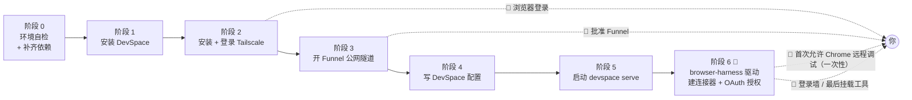

# chatgpt-mcp-connector

[English](README.md) · **简体中文**

**一个把本地自托管 MCP 服务器接入 ChatGPT 网页版的 Agent Skill。**
从环境自检开始，一路走到「在 ChatGPT 对话里真的调用到本地工具」为止，中途不需要你去翻文档。

> 实测环境：Windows 11 + Git Bash · DevSpace `1.0.8` · Tailscale `1.102.4` · Node `24.15.0` ·
> ChatGPT 新版中文 UI + Plus 账号。
> 版本差异会影响命令语法（尤其 Tailscale），照做前先跑一遍 `--version`。
>
> **平台支持**：Windows / macOS / Linux 三平台都支持，脚本无需改动。
> 但只有 **Windows 做过实机验证** —— macOS / Linux 的结论来自 DevSpace 源码阅读，未实机跑过。
> 差异集中在依赖安装方式、shell 解析、Tailscale 服务模型、路径写法四处，
> 详见 [`references/cross-platform.md`](references/cross-platform.md)。

---

## 它解决什么问题

「让 ChatGPT 网页版读我本地代码」这件事，网上教程很多，但真正卡人的从来不是原理，而是这些：

- 依赖**差一个就整条流程跑不通**，而且往往在最后一步才报错，前功尽弃；
- Tailscale 的登录、MagicDNS、Funnel 首次批准**分散在浏览器和后台**，脚本替不了，但没人告诉你该停在哪；
- DevSpace 配置写错一个键，**服务能起来但 ChatGPT 连不上**，日志里只有一句含糊的 404；
- 官方教程里 `devspace init` 是交互式的，**没法在自动化流程里跑**，于是只能手敲配置，很容易踩坑；
- 最要命的一条：配置文件被写坏了，工具顺手「帮你重置」——**Owner password 直接换掉，之前建的连接器全废**。

这个 Skill 把这些坑全部前置处理掉了。

---

## 特性

| 能力 | 说明 |
| --- | --- |
| **环境自检 + 自动补齐** | 7 项依赖（Node / npm / Git / Bash / Tailscale / DevSpace / better-sqlite3）+ 包管理器探测；`--install` 可自动安装缺失项 |
| **跨平台** | Windows / macOS / Linux 三平台的安装命令、CLI 位置、路径写法、shell 解析、Tailscale 服务模型差异全部处理；脚本按平台分支，**无需改代码** |
| **配置全自动写入** | 不依赖交互式 `devspace init`，直接按参数写 `config.json`，只改显式传入的键 |
| **容错与回滚** | 配置损坏**拒绝写盘**并另存 `.corrupt-*`、写前自动 `.bak` 备份、原子替换、超时重试、`rollback` 一键恢复 |
| **🤖 阶段 6 浏览器自动化** | 建连接器 + OAuth 授权由 agent 用 `browser-harness` 驱动浏览器自己完成，**用户不用手动填表**；ownerToken 就地读取填入，绝不回显 |
| **🙋 人工介入点提醒** | 明确标出**真正不可代劳**的 7 个步骤（UAC 提权、浏览器登录、Funnel 批准、首次允许 Chrome 远程调试等），检测到未登录/未启用会主动打提醒 |
| **故障速查** | 约 20 条常见报错的排查表，含「已证伪的伪根因」，避免在错误方向上浪费时间 |
| **安全边界说明** | 讲清 `allowedRoots` 不是沙箱、symlink 绕过、`DEVSPACE_ALLOWED_HOSTS=*` 的风险 |

---

## 前置条件

| 项 | 要求 | 备注 |
| --- | --- | --- |
| 操作系统 | Windows / macOS / Linux | 三平台均可；**实测在 Windows 11 + Git Bash** |
| Node.js | `>=20.12 <27` | README 官方口径 `>=22.19 <27`，CLI 内部更宽 |
| Bash | Windows：**必须** Git Bash ★ / MSYS2 / Cygwin / WSL / PortableGit<br>macOS / Linux：`/bin/bash`（一般自带） | Windows 上常并存多个，选错会导致 DevSpace 行为异常；**Windows 缺 bash 直接失败**（无兜底），macOS/Linux 会退化 `/bin/sh` |
| Git | 任意近期版本 | — |
| Tailscale | `1.102.4` 实测可用 | 需登录且开启 MagicDNS；Linux 上 CLI 默认要 root，建议 `--operator` |
| ChatGPT | 网页版 + 付费账号，需开启**开发者模式** | 连接器功能需要；开发者模式这一步由 agent 自动开 |
| browser-harness | 可选，`0.1.8+` | 让 agent 自动完成阶段 6（建连接器 + OAuth 授权）。没装则阶段 6 退化为人工作业，结果一致 |

> 平台差异速查（安装命令 / CLI 位置 / 路径写法 / 常见坑）见 [`references/cross-platform.md`](references/cross-platform.md)。

以上全部可以由 `env-check.mjs --install` 自动检查并补齐（安装时可能弹 UAC 提权）。

---

## 安装这个 Skill

把下面这段话**整段复制给 WorkBuddy / 你的 Agent**，它会自己完成安装和校验：

```text
请帮我把 chatgpt-mcp-connector 这个 Skill 安装到本地：

仓库地址：https://github.com/hawklithm/chatgpt-mcp-connector
克隆到你的 skill 目录 ——
  macOS / Linux : ~/.workbuddy/skills/chatgpt-mcp-connector
  Windows       : %USERPROFILE%\.workbuddy\skills\chatgpt-mcp-connector
（Windows 上 `~` 不会被展开，必须用 %USERPROFILE%；路径含空格要加引号）

  git clone https://github.com/hawklithm/chatgpt-mcp-connector.git "<目标目录>"

装好后用 skill-creator 的 quick_validate.py 校验一次，确认返回 "Skill is valid!"，
最后把 SKILL.md 里的 description 念给我看一下，确认它已经能被正确识别。
```

如果你想自己动手，命令行是两条（按平台挑一行）：

```bash
# 1. 克隆到用户级 skill 目录（跨项目可用）
git clone https://github.com/hawklithm/chatgpt-mcp-connector.git ~/.workbuddy/skills/chatgpt-mcp-connector
#    Windows（cmd / PowerShell）：`~` 不会被展开，用 %USERPROFILE%
git clone https://github.com/hawklithm/chatgpt-mcp-connector.git "%USERPROFILE%\.workbuddy\skills\chatgpt-mcp-connector"

# 2. 校验
python <skill-creator>/scripts/quick_validate.py ~/.workbuddy/skills/chatgpt-mcp-connector
```

**放在哪里？**

| 位置 | 作用范围 | 适用场景 |
| --- | --- | --- |
| `~/.workbuddy/skills/`（Windows：`%USERPROFILE%\.workbuddy\skills\`） | 用户级，**所有项目**可用 | 推荐，一次装好到处能用 |
| `<项目>/.workbuddy/skills/` | 项目级，随仓库共享 | 团队协作、想让同事克隆项目就有 |

> 如果你的 harness 用的是别的 skill 目录约定，装到那儿也一样 —— 只要 prompt 里的路径跟着换即可。
> Windows 上含空格的路径记得加引号。

装好后无需重启，下一次对话里提到「把本地 MCP 接入 ChatGPT」它就会被触发。

---

## 一键 prompt：让 Agent 装好并跑通全流程

上面那段只负责**装**。下面这段是**装完直接开跑**：把它整段粘给任意 harness（WorkBuddy / Claude Code /
Codex / Cursor …），它就会按 SKILL.md 的流程一路把配置做完 ——
**包括阶段 6 的连接器创建与 OAuth 授权**（由 agent 用 `browser-harness` 自己操作浏览器完成，
你不用手动填表），只在**真正不可代劳**的环节停下来等你。

它之所以能驱动任意 harness，是因为流程写在 **文件里**（`SKILL.md` + `references/`），
prompt 只负责把 harness 引到那儿、并逐阶段给出验收信号与暂停点，不依赖某个 harness 的私有能力。

```text
安装并跑通 chatgpt-mcp-connector 这个 skill，端到端。

目标：在本机跑起一个 MCP 服务器（DevSpace），让 ChatGPT 网页版通过公网 HTTPS 访问它，
      并能读写我指定目录下的文件。

== 准备 ==

0) 先确定两个路径变量。下面凡出现 <SKILL_DIR> / <PROJECT_DIR>，都替换成实际值：

   <SKILL_DIR> = 这个 skill 装在哪
       macOS / Linux : ~/.workbuddy/skills/chatgpt-mcp-connector
       Windows       : %USERPROFILE%\.workbuddy\skills\chatgpt-mcp-connector
   <PROJECT_DIR> = 允许 ChatGPT 读写的目录（第 3 步问我）

   ⚠️ Windows 特别注意：
     - `~` 在 cmd / PowerShell 里**不会被展开**，这两种 shell 里必须用 %USERPROFILE%；
       在 Git Bash 里 `~` 可以正常用。
     - 含空格的路径**必须加引号**（如 "C:\Program Files\Git\bin"），不加会被从空格处截断。
     - `&&` 在 cmd 与 PowerShell 7+ 可用；老的 PowerShell 5.1 不支持，请拆成两行执行。

1) 安装 skill（幂等，已装过就跳过）。仓库地址：
       https://github.com/hawklithm/chatgpt-mcp-connector
   克隆到 <SKILL_DIR>：
       git clone https://github.com/hawklithm/chatgpt-mcp-connector.git "<SKILL_DIR>"
   如果 git 本身不在 PATH 上，先按 <SKILL_DIR>/references/env-setup.md 装 Git for Windows。
   如果你的 harness 用别的 skill 目录约定，就装到那里、并把 <SKILL_DIR> 换成实际路径。

2) 完整读一遍 <SKILL_DIR>/SKILL.md。
   它是权威流程 —— 按它做，不要按你自己的印象做。
   然后再读 <SKILL_DIR>/references/cross-platform.md，只按你的操作系统那一节对号入座。

3) 问我「允许 ChatGPT 访问哪个目录」，记为 <PROJECT_DIR>。

== 执行 ==

按阶段顺序推进。每完成一个阶段，先汇报「你执行了什么 / 证据是什么 / 下一步做什么」，再继续。
凡是 SKILL.md 里标了 🙋 的步骤，**停下来问我** —— 那些确实没法代劳
（UAC 提权、浏览器登录、Funnel 批准、首次允许 Chrome 远程调试）。
**注意阶段 6 不在其中**：建连接器与 OAuth 授权由你自己用 browser-harness 完成，不要推给我。

阶段 0  环境自检（先只读）
    node "<SKILL_DIR>/scripts/env-check.mjs"
    把缺失项和你打算执行的安装命令列给我看，**等我说同意**，再加 --install 重跑。
    通过标准：输出以「✅ 全部就绪」结尾，退出码 0。
    注意：刚装完但 PATH 未刷新会返回 1，这时要新开终端再跑，不要报假绿。
    ⚠️ Windows 上多一条硬性标准：**Bash 那一项必须是 [ok]**。
       如果显示 [不可用] 且路径是 C:\Windows\System32\bash.exe，说明 DevSpace 选中了
       WSL 启动器而不是真 shell —— 那会让后面**所有**命令失败（连 echo 都不行）。
       先照 <SKILL_DIR>/references/troubleshooting.md 的「Windows：bash 被 WSL 启动器顶掉」
       修好再往下走；而且改完**必须重启 devspace serve** 才生效。

阶段 1  安装 DevSpace
    npm install -g @waishnav/devspace
    通过标准：devspace -v 能输出版本号。

阶段 2  安装并登录 Tailscale
    缺就装（按 <SKILL_DIR>/references/cross-platform.md 的对应平台命令），然后执行 tailscale up。
    🙋 暂停：终端会打印一个登录链接，必须由我用浏览器打开并授权该设备加入 tailnet。
    通过标准：tailscale status 能看到 Self，且 IP 是 100.x。

阶段 3  开公网隧道
    tailscale funnel --bg 7676
    绝对不要加 --set-path=/mcp —— 它会把挂载路径剥掉，公网 /mcp 变成 / 直接 404，
    而且 OAuth 的发现路由在 /mcp 之外。必须代理整个端口。
    🙋 若是首次启用 Funnel，终端会另给一个批准链接，也要我去浏览器点同意。
    通过标准：tailscale funnel status 出现 (Funnel on) 以及一行 proxy http://127.0.0.1:7676。

阶段 4  写 DevSpace 配置
    先用 dry-run 给我看会改什么（整条写成一行，免得 Windows shell 不认反斜杠续行）：
      node "<SKILL_DIR>/scripts/devspace-bootstrap.mjs" apply --roots "<PROJECT_DIR>" --dry-run
    我确认后再去掉 --dry-run 落盘。
    通过标准：启动日志里的 "allowed roots:" 一行与我要求的一致。

阶段 5  启动服务
    先切到 <PROJECT_DIR>，再执行 devspace serve     # 进程必须常驻，停了 ChatGPT 就断
    ⚠️ Windows：如果 `where git` 显示 Git for Windows **不在** %ProgramFiles%\Git 下
       （装在别的盘很常见），直接启动会让 DevSpace 又选中 WSL 启动器、shell 全废。
       这时要先把 Git 的 bin 前置到 PATH 再启动，cmd 里就是一行：
         set "PATH=<Git 安装根>\bin;%PATH%" && devspace serve
       <Git 安装根> 从 `where git` 的结果反推（去掉末尾的 \cmd\git.exe），
       或直接照 env-check 输出里「修法 ①」替你填好的那行抄。
    通过标准：http://127.0.0.1:7676/healthz 返回 200，
              且 https://<隧道域名>/healthz 也返回 200。
    注意：https://<隧道域名>/mcp 返回 **401 是正确的**，那是 OAuth 的触发点，不是故障。
    🙋 让它在后台常驻，并告诉我怎么停掉它。

阶段 6  用 browser-harness 自动建连接器并完成 OAuth 授权
    ⚠️ 这一步是「你自己操作浏览器」，不是「把该填的值列给我、让我自己填」。
    逐个环节先做、再汇报，每步都用一次回读确认操作真的生效了：

    A) browser-harness --doctor
       确认 chrome running、且 active browser connections 不为 0。
       （Browser Use cloud auth 报 FAIL 是正常的，本地 Chrome 用不到云端。）
       若连接为 0 → **这时才停下来找我**：我会在 Chrome 里勾选
       "Allow remote debugging for this browser instance" 并点 Allow。**只需一次**。
       ⚠️ 不要在循环里重试 —— Chrome 每个新连接都弹一个新对话框，重试等于反复骚扰我。

    B) 登录墙自检：new_tab("https://chatgpt.com/") + wait_for_load()，看 page_info()。
       落到登录页就停下来告诉我，**密码 / 验证码 / MFA 一律不要代填**。

    C) 开开发者模式（只需一次）：设置 → 账户安全与登录 → 开发者模式。开完回读开关状态。

    D) 建连接器。用深链接直达新插件弹窗，别去列表页找按钮：
       https://chatgpt.com/plugins#settings/Connectors?create-connector=true&redirectAfter=%2Fplugins
       填：名称 DevSpace / 连接方式「服务器 URL」/ URL = https://<隧道域名>/mcp
          / 身份验证 OAUTH / 勾选确认框（不勾「创建」永远 disabled）。
       🔎 提交前先自检：「高级 OAuth 设置」按钮是否从 disabled 的
          「输入有效的 MCP 服务器 URL…」变成 enabled 的「查看已发现的 OAuth 设置」——
          **没变就说明 OAuth 发现失败（URL 少了 /mcp、隧道不通、服务没起），别提交。**
       点「创建」后**等 ≥6 秒**再判定（提交是异步的，等不够会误判成失败）。

    E) 页面会跳到 https://<隧道域名>/authorize?...（**域名从 chatgpt.com 变成隧道域名**）。
       你自己从 ~/.devspace/auth.json 读 ownerToken（Windows: %USERPROFILE%\.devspace\auth.json），
       就地填进密码框，再点 Authorize DevSpace。
       🔐 绝不 print / 回显 / 写日志；绝不当命令行参数传（会进 shell 历史与进程列表）；
          回读校验只回长度（43）。

    通过标准：DevSpace 服务端日志出现 userAgent: openai-mcp/1.0.0 + 200 + mcp_session_created。
    🙋 最后一步要我做：新开一个对话，从工具菜单手动挂上 DevSpace（这步没有公开 API）。

    两个通用坑：每次 browser-harness 调用会重置当前标签页 —— 每个脚本开头重新选标签；
    授权流程会把标签页从 chatgpt.com 导航到隧道域名，所以匹配条件不能写死 chatgpt.com。
    点击一律用坐标 click_at_xy，不要用 JS .click()（对 ChatGPT 的 React 按钮经常无效）。

== 规则 ==

- 没有我针对某条命令的明确同意，不要执行任何安装。
- 阶段 6 **必须用 browser-harness 自己操作浏览器完成**，不要把该填的值列出来让我手动填。
  只有两种情况停下来找我：① 登录墙（密码 / 验证码 / MFA / 账号选择）；
  ② 首次允许 Chrome 远程调试。
- Owner password 永不进聊天、不进日志：你自己从 `~/.devspace/auth.json` 就地读、就地填；
  不 print、不回显、不作为命令行参数。只有在没有 browser-harness 的人工兜底路径下，
  才告诉我「去那个文件里自己看」。
- 绝不使用 tailscale funnel --set-path；始终代理整个端口。
- 任何一步失败，先读 <SKILL_DIR>/references/troubleshooting.md，不要自己乱试；
  浏览器环节失败先跑 `browser-harness --doctor`。
- 如果你的环境与文档里的前提不符（版本、路径、shell），直接说出来，不要猜。
- 判断依赖是否可用，一律跑它的命令看输出（`--version` / `where` / `which`）；
  不要因为「文件存在」就下结论，「文件在但跑不起来」是真实且常见的情况。
- 任何浏览器操作后都要**回读确认**（`js(...)` 或 `page_info()`），不要假设「点到了 = 生效了」。

现在从阶段 0 开始。
```

**这段 prompt 会保证的事**（也就是它替你挡住的东西）：

| 阶段 | 如果没人盯着，最容易怎么错 | prompt 里对应的约束 |
| --- | --- | --- |
| 全程 | 只给了「仓库路径」不给 URL，agent 不知道去哪下载；路径写死成 POSIX 的 `~/...`，在 Windows 上直接失效 | 开头就给出 `https://github.com/hawklithm/chatgpt-mcp-connector` 与完整 `git clone` 命令；定义 `<SKILL_DIR>` 并同时给出 Windows 的 `%USERPROFILE%` 写法 |
| 全程 | 用 bash 专有的反斜杠续行 / `~`，Windows shell 报错 | 命令一律写成一行、路径加引号；注明 `~` 不展开、PS 5.1 不支持 `&&` |
| 0 | 不打招呼就 `--install`，或把「刚装完 PATH 没刷新」当成装失败 | 先只读 → 列命令 → 等同意；并写明退出码语义 |
| 0 | Windows 上无视 Bash 显示 `[不可用]`（其实是 WSL 启动器顶掉了 Git Bash），一路跑到阶段 5 才发现所有命令全废 | 把「Bash 必须是 `[ok]`」立成阶段 0 的硬性标准，并指明改完必须重启 serve |
| 2 | 反复重跑 `tailscale up`，其实在等你去浏览器授权 | 明确划成 🙋 暂停点 |
| 3 | 顺手加 `--set-path=/mcp` → 公网 `/mcp` 404 | 直接写死禁令 + 原因 |
| 4 | 直接落盘，或调用交互式 `devspace init` 卡住 | 强制先 `--dry-run` 给 diff |
| 5 | 把公网 `/mcp` 的 401 误判成故障，回头去改服务端 | 写明「401 是正确的」 |
| 5 | Windows 上 Git 不在 `%ProgramFiles%\Git` 时直接 `devspace serve`，shell 工具全废 | 给出「先把 Git 的 bin 前置到 PATH 再启动」的具体一行命令 |
| 6 | 在「设置」里建连接器 → `Something went wrong` | 指明必须在 `plugins` 页，并给出深链接入口 |
| 6 | 把这步当成「只能人工」的活，把值列出来让用户自己填（其实 agent 完全能自己干） | 明确要求用 `browser-harness` 自己操作浏览器，只有登录墙和首次远程调试才停下 |
| 6 | 直接点「创建」才发现 OAuth 发现失败 → 又是 `Something went wrong` | 要求先自检「高级 OAuth 设置」按钮文案是否变 enabled 再提交 |
| 6 | 点完「创建」立刻判定结果（提交是异步的，弹窗稍后才关） | 要求等 ≥6 秒再判定 |
| 6 | 每次 `browser-harness` 调用重置标签页 → 误操作成别的标签 | 写明每个脚本开头重选标签，且匹配条件不能写死 `chatgpt.com`（授权流程域名会变） |
| 6 | 用 JS `.click()` 点 React 按钮 → 毫无反应 | 要求一律用坐标 `click_at_xy` |
| 6 | 连接失败就在循环里反复重试 → Chrome 反复弹对话框骚扰用户 | 写明「只需一次、不要在循环里重试」 |
| 6b | 让用户把 Owner password 贴进聊天 | 改为 agent 从 `auth.json` 就地读取直填；不 print、不当命令行参数、回读只回长度 |

---

## 快速开始（手动驱动）

装好之后，直接对 Agent 说一句也行：

```text
帮我把本地 MCP 接入 ChatGPT，可访问目录用 D:\projects\my-app，连接器也你帮我建好、授权也你做完。
```

它会按下面的流程走，并在需要你亲自操作的地方停下来提醒你：



> 阶段 6 是**自动化**的：agent 自己操作浏览器填表、自己填 Owner password，
> 不再需要你手动创建连接器。只有上图中标 🙋 的两处会打断你。

### 各阶段验收信号

| 阶段 | 关键命令 | 验收信号 |
| --- | --- | --- |
| 0 环境 | `node scripts/env-check.mjs` | 输出「✅ 全部就绪」 |
| 1 DevSpace | `npm i -g @waishnav/devspace` | `devspace -v` → `1.0.8` |
| 2 Tailscale | `tailscale up` → `tailscale status` | 有 `Self`，IP 为 `100.x` |
| 3 隧道 | `tailscale funnel --bg 7676` | `funnel status` 出现 `(Funnel on)` |
| 4 配置 | `devspace-bootstrap.mjs apply --roots ...` | 启动日志 `allowed roots:` 符合预期 |
| 5 启动 | `devspace serve` | `/healthz` 本地与公网均 200 |
| 6 连接器 | 🤖 `browser-harness` 驱动浏览器（agent 自动执行） | 日志出现 `openai-mcp/1.0.0` + `200` |

> 阶段 5 有个容易误判的点：公网 `/mcp` 返回 **401 是正确的**，那是 OAuth 的触发点，不是故障。

---

## 仓库结构

```
chatgpt-mcp-connector/
├── SKILL.md                        # 主文件：触发条件、0→1 流程、铁律、参考导航
├── references/                     # 分阶段详细文档（按需加载，不占主上下文）
│   ├── cross-platform.md           # 三平台对照：安装命令、路径、shell、Tailscale 服务模型、各平台坑
│   ├── env-setup.md                # 阶段 0–1：依赖清单、各平台安装、装完之后的环境坑
│   ├── tailscale-funnel.md         # 阶段 2–3：登录、Funnel 前置条件与语法、域名推导
│   ├── devspace-config.md          # 阶段 4–5：两个配置文件、环境变量总表、OAuth 持久化
│   ├── chatgpt-connector.md        # 阶段 6：browser-harness 自动化全流程、人工兜底步骤
│   └── troubleshooting.md          # 容错设计、故障速查表、已证伪的伪根因
├── scripts/
│   ├── env-check.mjs               # 环境自检 + 缺失自动补齐
│   └── devspace-bootstrap.mjs      # 配置写入 / 体检 / 回滚
├── README.md                       # English
├── README.zh-CN.md                 # 简体中文（本文件）
├── LICENSE
└── .gitignore
```

---

## 自带脚本

脚本目录按平台这样取一次，后面统一用 `$SK` 指代：

```bash
# macOS / Linux（bash、zsh）
SK=~/.workbuddy/skills/chatgpt-mcp-connector/scripts
```

```bat
:: Windows（cmd.exe）
set "SK=%USERPROFILE%\.workbuddy\skills\chatgpt-mcp-connector\scripts"
```

```powershell
# Windows（PowerShell）
$SK = "$env:USERPROFILE\.workbuddy\skills\chatgpt-mcp-connector\scripts"
```

> **Windows 下把示例里的 `$SK` 换掉**：cmd 用 `%SK%\env-check.mjs`，PowerShell 用 `"$SK\env-check.mjs"`。
> `~` 在 cmd / PowerShell 里**不会展开**，所以上面用的是 `%USERPROFILE%` / `$env:USERPROFILE`。
> 路径含空格时务必加引号。

### `env-check.mjs` —— 环境自检 + 缺失自动补齐

```bash
node $SK/env-check.mjs                             # 只读自检：打印结果 + 缺失项的安装命令
node $SK/env-check.mjs --json                      # 机器可读（供 Agent 解析）
node $SK/env-check.mjs --install                   # 真的执行安装
node $SK/env-check.mjs --install --only node,git   # 只装指定项
```

退出码：`0` 全就绪 / `1` 有缺失 / `2` 脚本自身出错。

- Node 按 `>=20.12 <27` 校验；
- 判断依赖装没装一律**跑命令**（`where` / `which` / `--version`），不去猜安装目录；
  Bash 候选从 `where bash.exe` 和 `where git` 反推，Git 装在哪个盘都能看见；
- Bash 会**列出所有候选并标推荐项**（★ Git Bash > MSYS2 > Cygwin > WSL > PortableGit）；
- Tailscale 读 `status --json` 的 `BackendState` 判断登录态，未登录时按平台给出不同提示；
- 每项独立 try/catch，外部命令带超时（探测 15s / 安装 10min）；
- `--install` 单项失败**不中断整轮**，末尾汇总「自动成功 / 自动失败 / 需手动 / 已跳过」；
- 找不到对应的包管理器时**跳过并说明**，而不是抛 ENOENT；
- 退出码反映**自检当时**的状态——刚装完但 PATH 未刷新仍返回 `1`，不报假绿。

> **⚠️ 安装前必须先征得同意。** 默认不安装任何东西，只有显式 `--install` 才会执行命令。

### `devspace-bootstrap.mjs` —— 写 DevSpace 配置

```bash
node $SK/devspace-bootstrap.mjs check        # 只读体检：Node / tailscale / 隧道 / 域名推导 / 现有配置
node $SK/devspace-bootstrap.mjs apply --roots "D:\projects\my-app" [--port 7676] [--host 127.0.0.1] [--public-base-url https://x.ts.net] [--subagents codex,claude] [--dry-run] [--force]
node $SK/devspace-bootstrap.mjs rollback [--config|--auth]   # 从 .bak 恢复
```

上面写成一行是有意的：反斜杠续行 `\` 是 bash 专有语法，cmd / PowerShell 会直接把它当字符吞掉。
macOS / Linux 把 `--roots` 换成正斜杠路径（如 `/home/you/projects/my-app`）。

**行为保证**

- `check` 绝不写盘；
- `apply` 只改**显式传入**的键，**绝不覆盖已有 `ownerToken`**，内容无变化时不动文件（幂等）；
- 自动从 Tailscale 推导 `publicBaseUrl`，无需手填；
- **不调用** `devspace init`（那是交互式的，会重问所有问题）。

**容错保证**

- 配置损坏时**拒绝写盘**并另存 `.corrupt-<时间戳>`，而不是静默清空；
- 写入前自动备份 `.bak`，采用**原子替换**（临时文件 + rename）；
- 所有校验在写盘前完成，失败即退出，**不留半成品**。

---

## 三条不可违背的铁律

1. **绝不 `tailscale funnel --set-path=/mcp`**
   挂载路径会被剥掉，公网 `/mcp` 变成 `/` → 404；而且 DevSpace 的 OAuth 路由在 `/mcp` 之外。
   必须代理整个 origin。

2. **连接器必须在 `chatgpt.com/plugins` 页创建**
   「设置」里只用来开开发者模式。两处表单字段一模一样，走错必报 `Something went wrong`。

3. **Owner password 只在浏览器授权页填写，且永不进聊天/日志**
   人工路径下永远不要让用户把它贴进聊天；自动化路径下由 agent 从 `auth.json`
   就地读取、就地填入表单 —— 不 print、不回显、不作为命令行参数。

---

## 安全边界（请务必读）

- `allowedRoots` **不是操作系统沙箱**——shell 命令以**本机用户权限**运行。
- 别把含密钥、客户数据、生产配置的仓库放进去；**先用只读 prompt 验证边界**。
- 白名单限制到当前真正需要的项目，别图省事填整个磁盘（脚本会对盘符级/主目录白名单告警）。
- 注意白名单内的 softlink：已知 issue #45，路径比较是字符串级、不解析 symlink 目标。
- `DEVSPACE_ALLOWED_HOSTS=*` 会关闭 Host 校验，**仅本地调试用**。
- 用完记得关公网入口：`tailscale funnel reset`。
- `ownerToken` 是 43 字符**明文**存在 DevSpace 配置目录下的 `auth.json`，等同于账号密码，注意文件权限。

---

## 常见问题

| 现象 | 去哪看 |
| --- | --- |
| `MCP server ... does not implement OAuth` | `references/troubleshooting.md` |
| ChatGPT 报 `Something went wrong` | 先检查是不是在 `plugins` 页建的连接器（铁律 2） |
| `path is outside allowed roots` | `references/devspace-config.md` |
| 隧道域名变了、连接器连不上 | `references/tailscale-funnel.md`，重建或 Refresh 连接器 |
| 配置文件损坏 / 想回退改动 | `references/troubleshooting.md`，用 `rollback` |
| Funnel 用不了 | `references/troubleshooting.md` 的降级路径（cloudflared） |
| 装了却说「找不到命令」 | `references/cross-platform.md`（PATH 未刷新 / Homebrew 不在 PATH / npm 全局命令目录不在 PATH） |
| Linux 上 `tailscale` 报权限错误 | `sudo tailscale up --operator=$USER`，见 `references/cross-platform.md` |
| 路径在白名单里却报 `path is outside allowed roots` | Linux 大小写敏感：`~/Projects` 与 `~/projects` 是两个目录 |
| ChatGPT 里看不到 `download_artifact` 工具 | 正常 —— 该工具只在 Linux 上注册 |

---

## 外部参考

- DevSpace 官方文档：仓库 `Waishnav/devspace` 下的 `docs/`
- OpenAI 连接器文档：`developers.openai.com/plugins/deploy/connect-chatgpt`
- Tailscale Funnel：`tailscale.com/kb/1247/funnel-serve-use-cases`

---

## 许可证

[MIT](LICENSE) © 2026 hawklithm
